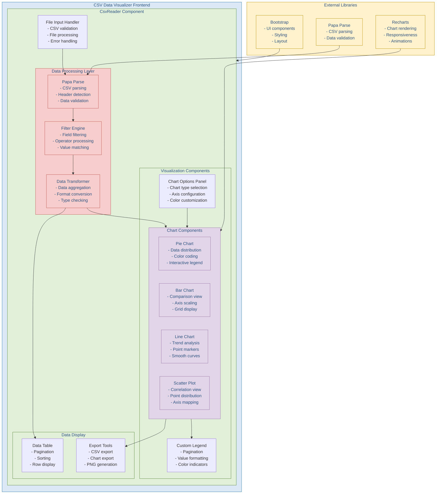

# HEX CSV Data Visualizer Architecture

This document outlines the architecture of the HEX CSV Data Visualizer tool, including its component hierarchy, data flow, and key features.

## Component Overview

### Main Components
1. **File Input Handler**
   - CSV file validation
   - File processing
   - Error handling
   - File metadata management

2. **Data Processing Layer**
   - Papa Parse integration for CSV parsing
   - Data validation and cleaning
   - Filter engine for data manipulation
   - Data transformation for visualization

3. **Visualization Components**
   - Chart Options Panel for customization
   - Multiple chart types (Pie, Bar, Line, Scatter)
   - Custom legend with pagination
   - Interactive tooltips and animations

4. **Data Display**
   - Paginated data table
   - Export functionality
   - Data filtering interface
   - Row display options

### Features
1. **Data Processing**
   - CSV parsing and validation
   - Dynamic filtering system
   - Data aggregation
   - Type conversion

2. **Visualization**
   - Multiple chart types
   - Customizable colors
   - Axis configuration
   - Legend management

3. **Export Capabilities**
   - Filtered CSV export
   - Chart image export
   - PNG generation
   - Data table export

4. **User Interface**
   - Responsive design
   - Interactive components
   - Error handling
   - Loading states

### External Libraries
- Recharts for chart rendering
- Papa Parse for CSV handling
- Bootstrap for UI components
- React for component management

This architecture ensures:
1. Efficient data processing
2. Flexible visualization options
3. User-friendly interface
4. Robust error handling
5. Scalable component structure